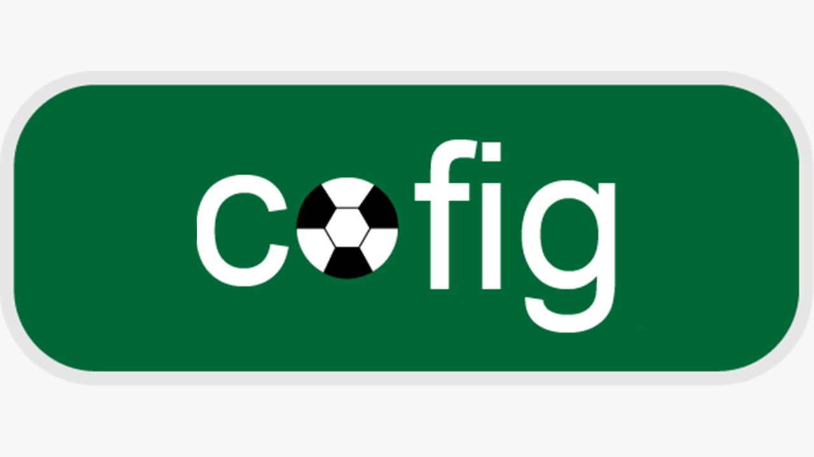

# CoFig

  <h6> Sabemos a importância de colar figurinhas no contexto na copa do mundo, então, com essa preocupação criamos o Cofig, um sistema de gerenciamento de figurinhas.
  O usuário desse gerenciador conseguirá ter experiências como comprar figurinhas, colar e apostar figurinhas com um bot, onde ele irá poder escolher uma dessas opções  </h6>
  

# Tecnologia Utilizada

<h6> Haskell </h6>

 

# Colaboradores

  - Alfredo 
  - Paulo 
  - Diego 
  - Thaís
  - Pedro

  

# Como utilizar o Cofig?
